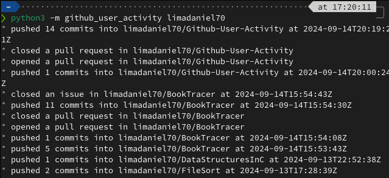

# Github-User-Activity

> [!NOTE]
> This is a sample solution to [Roadmap.sh](roadmap.sh) [Github user activity challenge](https://roadmap.sh/projects/github-user-activity) challenge.

## How to run

### Installing python wheel

Simply download the wheel file on the project [releases](https://github.com/limadaniel70/Github-User-Activity/releases/) and run:

```bash
pip install github_user_activity-0.1.2-py3-none-any.whl
```

After, just run:

```bash
python3 -m github_user_activity <username>
```

Here's an exmaple:


